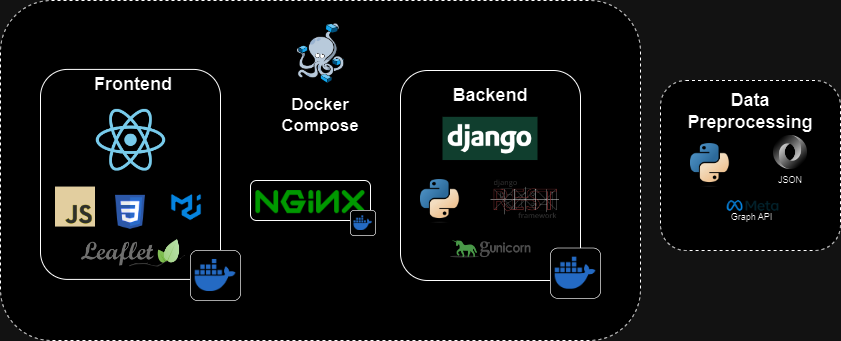

> **⚠️ Disclaimer:**
> Dieses Repository soll nur einen Überblick über ein  Projekt geben. Das Projekt liegt hier **nicht in Vollständigkeit** vor, nur in ihrer Datei Struktur mit **ausgewählten** Dateien und Erläuterungen dazu in dieser readme Datei. 

This project is a full-stack web application, using **Django** on the backend, providing API Endpoints via django REST framework. On the frontend ReactJS is being used. Containerized with **Docker** and docker compose. **Nginx** handles serving staticfiles, acting as a reverse proxy together with **gunicorn**.

Core component is an interactive **map view**, showcasing the locations of hiking trips with additional information such as an image and a button redirecting to the corresponding instagram post.

The displayed data is prepared in the **data preprocessing** step. For now the application uses **sqlite** for its database, as it is django's default and sufficient for the application.


## Table of Contents
1. [Architecture](#architecture)

2. [Details](#details)
3. [Tools Used](#tools-used)
4. [Additional Notes](#additional-notes)


## Architecture


**Frontend | ReactJS** [DETAILS](#frontend)  
- Handles the user interface and client-side logic.

**Backend | Django**   [DETAILS](#backend)
- Manages server-side logic, database interactions, and API endpoints.

**Nginx**  [DETAILS](#web server | nginx)
   - Serves static files and acts as a reverse proxy to handle client requests

**Docker**  [DETAILS](#docker)
 - Containerize environment for easier deployment and consistency between platforms

**Data Preprocessing** [DETAILS](#preprocessing)
- Prepares data to cater django models


# Details
This section takes a closer look on selected parts of the application. 
## Backend


### Models

A model is source of information about the data. It contains the essential fields and behaviors of the data that is stored. Generally, each model maps to a single database table.  
This application contains two main models:

<i>spots > models.py</i>

- **Spots**  
The Spots model contains data about the spot:
  <details open>
    <summary>Spots Model Fields</summary>
    <i>spots > models.py</i>

    ```json
      {
        "spot_id":"001",
        "latitude":50.1333916667,
        "longitude":6.7517388889,
        "date":"2021-09-01T17:06:14Z",
        "location_type":"Spot",
        "image_id":"th_spot_1x1_0001",
        "country":"Deutschland"
    },
    ```
  </details>


 - **InstaPost**  
 The InstaPost Model contains data about corresponding instagram posts: 
    <details open>
      <summary>InstaPost Model Fields</summary>
      <i>spots > models.py</i>

      ```json
        {
          "spot_id": 001,
          "permalink": "https://example.com/post1",
          "timestamp": "2024-04-18T12:00:00Z",
          "insta_post_id": 12345
      },
      ```
    </details>

<details>
<summary>File preview spots > modely.py</summary>

  ```python
  # from django.db import models
  from django.db import models

  class Spot(models.Model):

      type_choices = (
          ('spot', 'Spot'),
          ('track', 'Track')
      )

      id = models.AutoField(primary_key=True)
      spot_id = models.IntegerField(default=0)
      latitude = models.FloatField(null=True, blank=True, default=0)
      longitude = models.FloatField(null=True, blank=True, default=0)
      image_id = models.CharField(null=True, max_length=255)
      date = models.DateField(null=True)
      location_type = models.CharField(null=True, max_length=100, choices=type_choices, default='spot')
      country = models.CharField(max_length=255, default='')

      def __str__(self):
          return f"Spot {self.id}"


  class InstaPost(models.Model):

      id = models.AutoField(primary_key=True)
      spot_id = models.IntegerField()
      permalink = models.URLField(null=True, max_length=255)
      timestamp = models.DateTimeField()
      insta_post_id = models.IntegerField()


  ```

</details>

### REST Api

The application utilizes the Django REST Framework (DRF), which helps with creation of API endpoints, which are built around customized Django models. DRF not only simplifies endpoint creation but also automatically generates a browsable API interface. Interaction with React occurs through fetch calls to these endpoints, with JSON responses processed and displayed on the frontend.

### Settings Module

  <i>core > settings </i>  

  To avoid headaches and inconsistency between development and production environments, a settings package is implemented.  
  It consistens of  
  - ``base.py``  
  - ``development.py``
    - inherits from ``base.py``
    - uses localhost as Url in settings
  - ``production.py``  
    - inherits from ``base.py``
    - uses domain name in settings
    - static files location

Default settings for the **production** enviornment in the docker container are set in ``entrypoint.sh``:
```sh
set DJANGO_SETTINGS_MODULE=core.settings.production
```
For **local development** the development server is started with:
```sh
py manage.py runserver --settings=core.settings.development
```


### Other

<details>
  <summary>Management Commands</summary>

  <i>spots > management</i>

  To populate the django database a management command was build.  
  It reads a local .json and fills the Spots and InstaPost models. 

  <details>
    <summary>populate_spots.py</summary>

  <i>spots > management > populate_spots.py</i>

  #### Usage:

  ```py
  py manage.py populate_spots
  ```
</details>

<details>
  <summary>populate_instapost.py</summary>

<i>spots > management > populate_spots.py</i>

  #### Usage:

  ```py
  py manage.py populate_instapost
  ```

</details>

</details>

<details>
  <summary>Custom User Model</summary>
  <i>users > models.py </i>

  Curently only used for development purposes, while the site is still under construction. Authorises User to acces private route on the website.  
  Uses Email address instead of username as primary login.
  

</details>


## Frontend

Intro. MUI blablabla

### Map View
The map view consists of two main components:
- **Sidebar**: Vertically scrollable list showing every image available
- **Map**: A **leaflet** map with custom markers  

Upon clicking on a marker or an element in the the map centers on the location of that spot.  
Further a widget opens on the left hand side of the map, showing details about the selected spot. The widget also includes a button to redirect the browser to the matching instagram post on instagram.com.
The application keeps track of the active element via an ActiveSpotIndex react context.

The Sidebar is collapsible to the left, which enlarges the map to the full view width.

<details open>
  <summary>Preview on map view</summary>

  gif here

</details>

<details>
  <summary>Sidebar</summary>
</details>
<details>
  <summary open>Map</summary>

  The map itself is initialiized in a react-leaflet ``<MapContainer>`` component.

  The marker icon is conditionally rendered based on the ``activeSpotIndex`` context value. Instead of using the default leaflet ``<PopUp>`` component, each marker has a custom ``<PopUpWidget>`` component attached to it.

  The location of the marker, as well as the information shown in PopUpWidget is retrived from the ``spotsData`` and ``instaPostData`` context.

</details>

[gif]  
[activeContext]
[popupwidget]

### Landing Image
Responsive, **css** cover image animation.  
Used triangula to stylize a real image, seperated image components with Adobe Illustrator and used css to layout and animate elements.

<details open>
  <summary>Preview landing image</summary>

   


</details>

### Contexts

To keep states consistent between components, this application uses react contexts.

#### ActiveIndexContext
Shared index between. Allows for interaction between elements
#### spotData
Contains data to every spot.
#### instaPostData
Contains data to instagram posts.

### Custom Hooks

### Other Components

<details>
  <summary>Scroll Up</summary>  

  <i>components > ScrollUp.jsx </i>  
   Scrolls page up to the top on click.
</details>
<details>
  <summary>Snackbar Manager</summary>

  <i>components > SnackbarManager.jsx</i>

  Feedback on Login and Logout.  
  Currently used for development purposes only, as the next development step will have the content on a private route.

  Handled inside the **AuthProvider**:

  ```js
  // Example if response is not ok
  export const AuthProvider = ({ children }) => {
    const [code, setSnackBarCode] = useState(null);
    {...}
    try {
      {...}
      {...}
    }
    if (!response.ok) {
                  // If the response status is not ok (e.g., 400 Bad Request or 401 Unauthorized),
                  if (response.status === 400) {
                      // login failed
                      setSnackBarCode('LOGIN_FAILED')
                  } else if (response.status === 401) {
                      // authentication not valid
                      setSnackBarCode('LOGIN_FAILED')
                  } else {
                      // everything else
                      // TODO: more specific
                      setSnackBarCode('WHATEVER');
                  }
                  return;
              }
    {...}
    return (
          <AuthContext.Provider value={contextData}>
              {children}
              {<SnackbarManager authStatusCode={code} />}
          </AuthContext.Provider>
      )
  }
  ```

</details>

## Web Server | nginx

Nginx helps to put the whole application together. As a web server it connects frontend with the backend, handles html entry, handles static files and takes care of redirecting to https with ssl certificates.


#### Serving staticfiles
  As Django doesn't (effectively) serve staticfiles in production mode with ``DEBUG=True`` further tools are needed. This is were nginx and gunicorn come in.

  Gunicorn acts as an interface between the web server (nginx) and the Django application.
  Static files not just include images used in the map view, in this case it also includes CSS, JS files required to properly show the django admin page.

  ```sh
   # static files
   location /staticfiles/ {
    alias /app/backend/staticfiles/;
    }
  ```

  When a request URL matches `/staticfiles/` nginx applies the configuration inside this block.

  For example:  
  A request for http://weizenblick.de/staticfiles/example.css is made:   
  - NGINX sees the URL matches ``/staticfiles/``  
  - NGINX serves the file from ``/app/backend/staticfiles/example.css``


#### HTTPS in production
NGINX also handles HTTPS termination, ensuring secure communication between clients and the server by managing SSL certificates.
<i>nginx > default.conf </i>
```sh
# http redirect
server {
    listen 80;
    listen [::]:80;
    server_name weizenblick.de;
    return 301 https://$host$request_uri;
}

server {
    listen 443 ssl;
    server_name weizenblick.de;

    # ssl certificates location
    ssl_certificate /---/nginx/ssl/----.cer;
    ssl_certificate_key /---/nginx/ssl/----.key;
    ...
}

```
In the provided NGINX configuration, the first server block listens on port 80 (HTTP) and redirects all incoming HTTP requests to the HTTPS version of the site.  This ensures that all traffic is securely routed over HTTPS.   
The second server block listens on port 443 (HTTPS), managing SSL certificates for secure communication. The ssl_certificate and ssl_certificate_key directives specify the locations of the SSL certificate and key files.

## Docker


The backend and frontend are containerized using **Docker**, each with their own **Dockerfile**. This approach isolates the environments, ensuring that both the Django backend and React frontend have all the dependencies they need within their respective containers.  

**Docker Compose** comes into play here, managing the multi-container application efficiently. It allows to define and run multi-container Docker applications with a simple docker-compose.yml file, enabling easy deployment and consistency across different environments and platforms.  

#### Basic Setup

The docker-compose.yml file defines a multi-container application setup with two primary services: backend and nginx. Each service has its own Dockerfile to build its respective container.  
 The backend service handles the application logic and API endpoints, while the nginx service manages the web server, SSL certificates, and serves static files. Volumes are used to share and persist static files between the containers, ensuring consistency and efficient file handling.


#### Static Volume

The static volume is defined to store and serve static files. This volume is mounted in both the backend service (to collect static files) and the nginx service (to serve these files), ensuring that changes in static files are consistently reflected across both services.  
It maps/mounts a directory of the host to a directory of a container:   

```docker
volumes:
    - host directory:container directory
```

- In the backend service, the volume static:/app/backend/staticfiles means that the host's static volume is mapped to the /app/backend/staticfiles directory in the container.

- In the nginx service, the same volume static:/app/backend/staticfiles ensures that NGINX can access the same static files from the same location.


## Preprocessing
The preprocessing phase involves several Python scripts that prepare the data for subsequent steps:

#### Process **exif** data of images:  
  This step involves getting relevant **metadata** from the selected images. For the purpose of this application this only includes latitude and longitude. It will be used to properly set the markers on the map at their location.  

   Additionally, the process includes reverse geocoding using **OpenStreetMap's Nominatim** service to obtain additional information such as the country associated with each GPS coordinate.
#### Gets details to Instagram Posts via **Meta Graph API**

To include redirects in the application's PopUpWidget, URLs linking to the respective Instagram posts are required. These URLs are obtained using the **Meta Graph API**.  

  As the PopUpWidget also includes a button to redirect to the respective instagram post of the selected spot, links/urls are required. These are obtained using  the Meta Instagram Graph API. 
#### Format data to **JSON** files to use with Django Models
 
The collected data is formatted into two JSON files: one tailored for the Django Spot model and another for the InstaPost model.   
These files serve as structured inputs for populating the database using custom Django management commands, as described in the backend section above.


# Tools used
### Development
- Visual Studio Code
- [Git](https://www.git-scm.com/https://www.git-scm.com/)
- [Docker](https://www.docker.com/)
- [Docker Compose](https://docs.docker.com/compose/)
- [Anaconda Package Manager](https://docs.anaconda.com/anaconda/pkg-docs/)  


#### Python Packages
##### Django environment
- django
- django-cors-headers
- [djangorestframework](https://www.django-rest-framework.org/)
- djangorestframework-simplejwt
- [gunicorn](https://gunicorn.org/)
- whitenoise
##### Preprocessing
- exifread
- [pandas](https://pandas.pydata.org/)
- nominatim

#### Node packages
- [Material UI](https://mui.com/material-ui/getting-started/)
- [Leaflet](https://leafletjs.com/)
- [React Leaflet](https://react-leaflet.js.org/)
- react router dom

### Graphics
- [triangula](https://github.com/rh12503/triangula)
- [MUI Icons](https://mui.com/material-ui/material-icons/)
- Adobe Illustrator
- Adobe Photoshop


## Additional Notes
**What is Weizenblick?**

Beginning of Covid I talked with friends who live further away to meet up again. But basically everwhere in the cities everything was closed, so we figured why not meet somewhere in the middle outside.

We ended up meeting in the "Pfälzerwald" area for a hike. There I happend to take a picture of a weizenbier with a nice view in the background. Ever since then we probably hiked all over this area and many more places and it became kind of a tradition to take a picture on a hike with a view and a beverage.  
Non-Alcoholic beers exists.

All images included are taken by myself for an instagram account.


Allgäuer Alpen
Liechtenstein
Malta
Mallorca
Pfälzerwald
Dreiländereck Deutschland Belgien Niederland
Nördlichster Punkt Deutschlands, Sylt
Biberkopf, 2700m, Allgäuer Alpen


